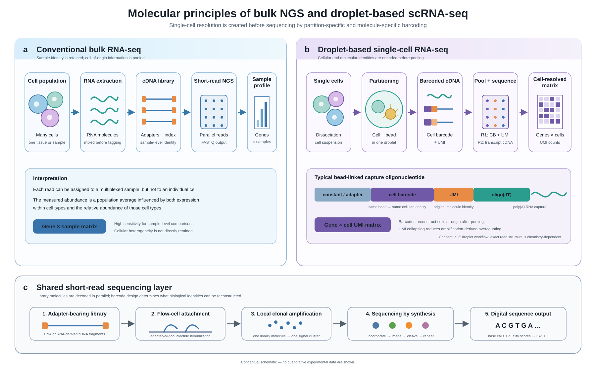

# Molecular Principles of NGS and Single-Cell RNA Sequencing

This repository contains an editable scientific schematic and an English-language explanation of the molecular logic shared by conventional next-generation sequencing (NGS) and droplet-based single-cell RNA sequencing (scRNA-seq).

The central distinction is simple:

- conventional bulk RNA-seq pools RNA from many cells and measures an average sample-level signal;
- droplet-based scRNA-seq partitions cells before reverse transcription, adds a **cell barcode** to preserve cellular origin, and adds a **unique molecular identifier (UMI)** to identify original captured molecules;
- both workflows ultimately produce sequencing-compatible libraries and can use massively parallel short-read sequencing-by-synthesis.

## Repository contents

```text
ngs-single-cell-molecular-principles/
├── figures/
│   ├── ngs_vs_scrna_molecular_principles.png
│   └── ngs_vs_scrna_molecular_principles.svg
├── docs/
│   ├── figure_legend.md
│   └── molecular_principles.md
├── QA_NOTES.md
├── LICENSE
└── README.md
```

## Figure



The SVG is the editable source figure, and the PNG is a ready-to-view 1800 × 1120 preview. SVG labels and vector elements remain editable in Inkscape, Adobe Illustrator, Affinity Designer, PowerPoint, or any text editor that supports SVG.

## Scope and scientific boundaries

The single-cell panel depicts a **typical droplet-based 3′ gene-expression workflow**, such as the general logic used by Chromium-style assays. Exact oligonucleotide structures, barcode lengths, read structures, amplification steps, and supported RNA species depend on the platform and chemistry version.

The figure does not imply that every single-cell assay uses droplets or poly(A) capture. Plate-based scRNA-seq, combinatorial indexing, single-nucleus RNA-seq, scATAC-seq, and multiome assays use different upstream molecular reactions. They retain the same broad requirement: molecular identities must be associated with the cell, nucleus, or partition from which they originated.

## Suggested use

This repository is suitable for:

- molecular-biology learning notes;
- bioinformatics portfolio documentation;
- introductions to bulk RNA-seq and scRNA-seq workflows;
- laboratory presentations and method overviews;
- explaining why scRNA-seq produces a gene-by-cell UMI matrix rather than a sample-level abundance table.

## Key references

1. Illumina. [Sequencing by Synthesis technology](https://www.illumina.com/science/technology/next-generation-sequencing/sequencing-technology.html).
2. 10x Genomics. [Getting Started: Single Cell 3′ Gene Expression](https://www.10xgenomics.com/support/universal-three-prime-gene-expression/documentation/steps/experimental-design-and-planning/getting-started-single-cell-3-gene-expression).
3. Zheng GXY et al. Massively parallel digital transcriptional profiling of single cells. *Nature Communications* **8**, 14049 (2017). [doi:10.1038/ncomms14049](https://doi.org/10.1038/ncomms14049).
4. Macosko EZ et al. Highly Parallel Genome-wide Expression Profiling of Individual Cells Using Nanoliter Droplets. *Cell* **161**, 1202–1214 (2015). [doi:10.1016/j.cell.2015.05.002](https://doi.org/10.1016/j.cell.2015.05.002).
5. Kivioja T et al. Counting absolute numbers of molecules using unique molecular identifiers. *Nature Methods* **9**, 72–74 (2012). [doi:10.1038/nmeth.1778](https://doi.org/10.1038/nmeth.1778).

## License

The original explanatory text and schematic are released under the MIT License. External trademarks and referenced technologies remain the property of their respective owners.
